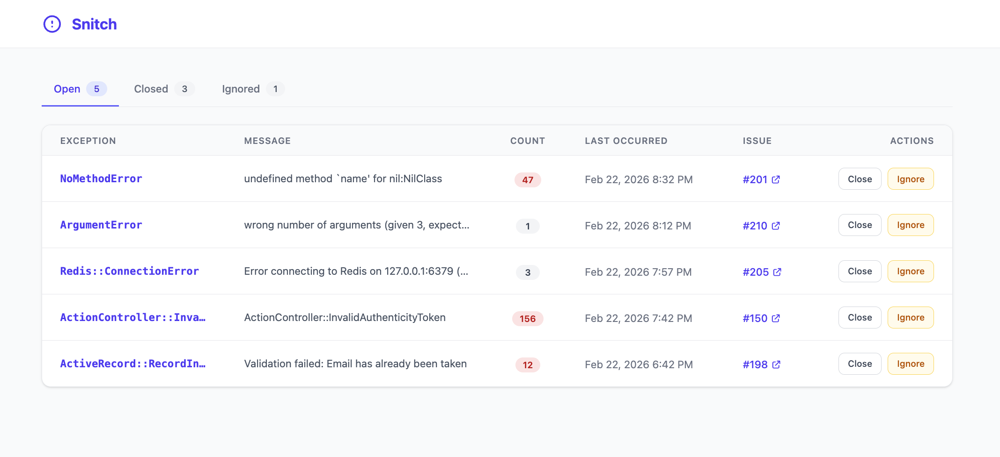

# Snitch

Snitch catches unhandled exceptions in your Rails application, persists them to the database, and reports them as GitHub issues that @mention Claude for automated investigation.


## Features

- Automatic exception capture via Rack middleware
- Fingerprinting and deduplication (increments occurrence count for repeat exceptions)
- GitHub issue creation with full backtrace, request context, and @mentions
- **Dashboard** at `/snitches` with tabbed views: Open, Closed, and Ignored
- Ignore exceptions via config or directly from the dashboard
- Manual exception reporting for rescued exceptions

## Installation

Add Snitch to your Gemfile:

```ruby
gem "snitch-rails", require: "snitch"
```

Run bundle install:

```bash
bundle install
```

Run the install generator:

```bash
rails generate snitch:install
rails db:migrate
```

The installer mounts the dashboard to `config/routes.rb`:

```ruby
mount Snitch::Engine, at: "/snitches"
```

### Upgrading from a previous version

If you're upgrading from a version prior to 0.3.0, run the update generator to add the `status` column to the `snitch_errors` table:

```bash
rails generate snitch:update
rails db:migrate
```

Then mount the engine in your `config/routes.rb`:

```ruby
mount Snitch::Engine, at: "/snitches"
```

## Configuration

The generator creates an initializer at `config/initializers/snitch.rb`. Update it with your settings:

```ruby
Snitch.configure do |config|
  # Required: GitHub personal access token with repo scope
  config.github_token = ENV["SNITCH_GITHUB_TOKEN"]

  # Required: GitHub repository in "owner/repo" format
  config.github_repo = "your-org/your-repo"

  # Who to @mention in GitHub issues (default: "@claude")
  config.mention = "@claude"

  # Enable/disable Snitch (default: true)
  config.enabled = Rails.env.production?

  # Exceptions to ignore (default: ActiveRecord::RecordNotFound, ActionController::RoutingError)
  config.ignored_exceptions += [YourCustomError]
end
```

### GitHub Token

Create a [personal access token](https://github.com/settings/tokens) with the `repo` scope and set it as an environment variable.

## Dashboard

Visit `/snitches` in your browser to view the Snitch dashboard.



The dashboard provides three tabs:

- **Open** — Exceptions that need attention. Shows the most recently occurred first.
- **Closed** — Exceptions that have been resolved. You can reopen them if they recur.
- **Ignored** — Exceptions you've chosen to suppress. Ignored exceptions will not create new GitHub issues even if they occur again.

From the dashboard you can change the status of any exception:
- Open exceptions can be **closed** or **ignored**
- Closed or ignored exceptions can be **reopened**

### Ignoring Exceptions

There are two ways to ignore exceptions, and Snitch honors both:

1. **Via the initializer** — Add exception classes to `config.ignored_exceptions`. These are filtered at the middleware level and never captured or persisted.
2. **Via the dashboard** — Mark individual exceptions as "Ignored" from the Open tab. Future occurrences of that exception class will be silently skipped — no new records, no GitHub issues.

Both sources are checked every time an exception is caught. If an exception class appears in either the initializer config or has a record with status "ignored" in the database, it will be ignored.

## Manual Reporting

Snitch automatically catches unhandled exceptions via middleware, but you can also report exceptions you rescue yourself:

```ruby
begin
  SomeExternalService.call(params)
rescue ExternalService::Timeout => e
  Snitch::ExceptionHandler.handle(e)
  # continue with your fallback logic
end
```

This is useful for exceptions you want to recover from gracefully but still want visibility into — failed API calls, flaky third-party services, background job retries, etc.

The same fingerprinting and deduplication rules apply. If the same exception is reported multiple times, Snitch will increment the occurrence count and comment on the existing GitHub issue rather than creating a new one.

## How It Works

1. Rack middleware catches any unhandled exception (and re-raises it so normal error handling still applies)
2. The exception is fingerprinted using a SHA256 hash of the exception class and the first application backtrace line
3. A `snitch_errors` record is created (or updated if the same fingerprint already exists, incrementing the occurrence count)
4. An ActiveJob is enqueued to create a GitHub issue (or comment on the existing one for duplicate exceptions)
5. The GitHub issue includes the full backtrace, request context, and an @mention for investigation

## Roadmap

- [x] Dashboard to view and manage captured exceptions
- [ ] Multi-db support
- [ ] Webhook to resolve snitch records when GitHub issues close

## Requirements

- Ruby >= 3.1
- Rails >= 7.0
- An ActiveJob backend (Sidekiq, GoodJob, etc.) for async GitHub reporting

## License

MIT
