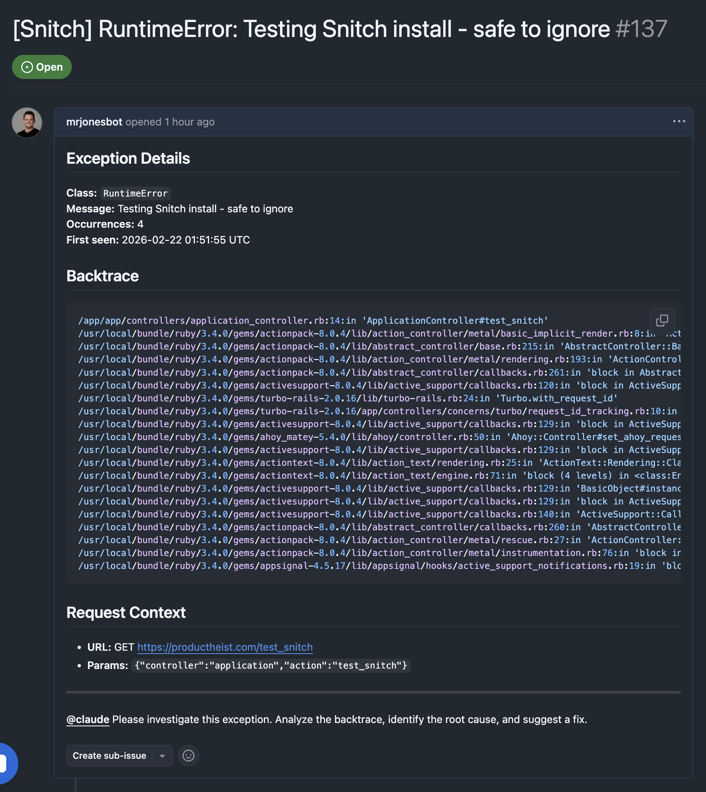

# Snitch

Snitch catches unhandled exceptions in your Rails application, persists them to the database, and reports them as GitHub issues that @mention Claude for automated investigation.



## Installation

Add Snitch to your Gemfile:

```ruby
gem "snitch-rails", require: "snitch"
```

Run bundle install:

```bash
bundle install
```

Run the install generator to create the migration and initializer:

```bash
rails generate snitch:install
```

Run the migration:

```bash
rails db:migrate
```

## Configuration

The generator creates an initializer at `config/initializers/snitch.rb`. Update it with your settings:

```ruby
Snitch.configure do |config|
  # Required: GitHub personal access token with repo scope
  config.github_token = ENV["SNITCH_GITHUB_TOKEN"]

  # Required: GitHub repository in "owner/repo" format
  config.github_repo = "your-org/your-repo"

  # Who to @mention in GitHub issues (default: "@claude")
  config.mention = "@claude"

  # Enable/disable Snitch (default: true)
  config.enabled = Rails.env.production?

  # Exceptions to ignore (default: ActiveRecord::RecordNotFound, ActionController::RoutingError)
  config.ignored_exceptions += [YourCustomError]
end
```

### GitHub Token

Create a [personal access token](https://github.com/settings/tokens) with the `repo` scope and set it as an environment variable:

## Manual Reporting

Snitch automatically catches unhandled exceptions via middleware, but you can also report exceptions you rescue yourself:

```ruby
begin
  SomeExternalService.call(params)
rescue ExternalService::Timeout => e
  Snitch::ExceptionHandler.handle(e)
  # continue with your fallback logic
end
```

This is useful for exceptions you want to recover from gracefully but still want visibility into — failed API calls, flaky third-party services, background job retries, etc.

The same fingerprinting and deduplication rules apply. If the same exception is reported multiple times, Snitch will increment the occurrence count and comment on the existing GitHub issue rather than creating a new one.

## How It Works

1. Rack middleware catches any unhandled exception (and re-raises it so normal error handling still applies)
2. The exception is fingerprinted using a SHA256 hash of the exception class and the first application backtrace line
3. A `snitch_errors` record is created (or updated if the same fingerprint already exists, incrementing the occurrence count)
4. An ActiveJob is enqueued to create a GitHub issue (or comment on the existing one for duplicate exceptions)
5. The GitHub issue includes the full backtrace, request context, and an @mention for investigation

## Roadmap

- [ ] multi-db support
- [ ] simple dashboard to view captured exceptions (linked to gh issue)
- [ ] webhook to resolve snitch record, when issues resolve

## Requirements

- Ruby >= 3.1
- Rails >= 7.0
- An ActiveJob backend (Sidekiq, GoodJob, etc.) for async GitHub reporting

## License

MIT
